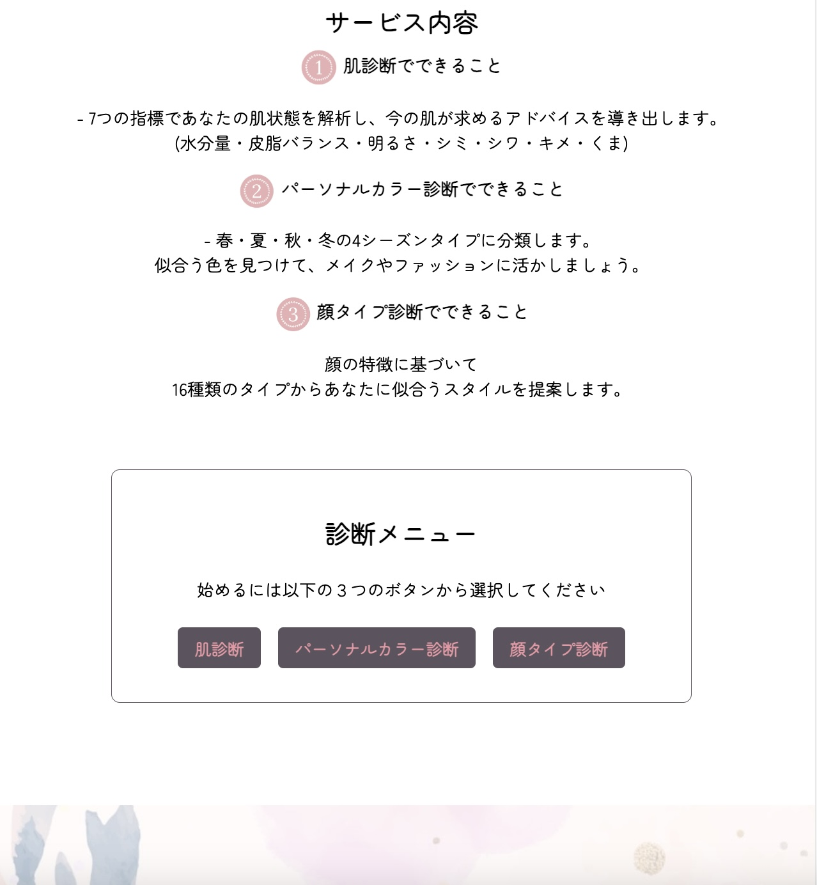
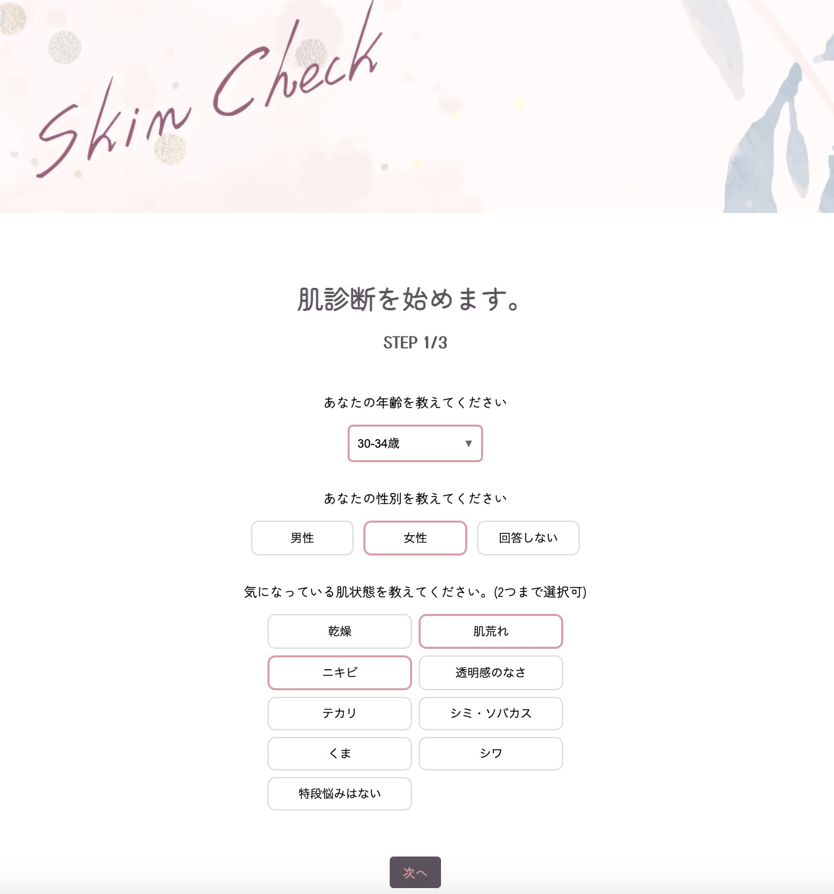
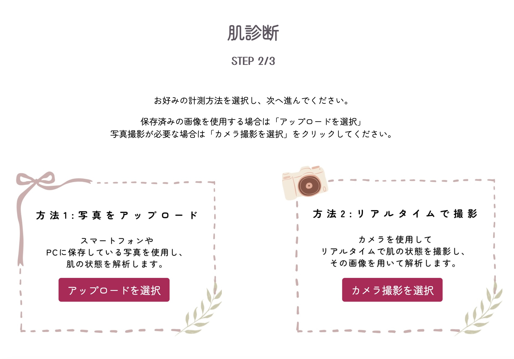
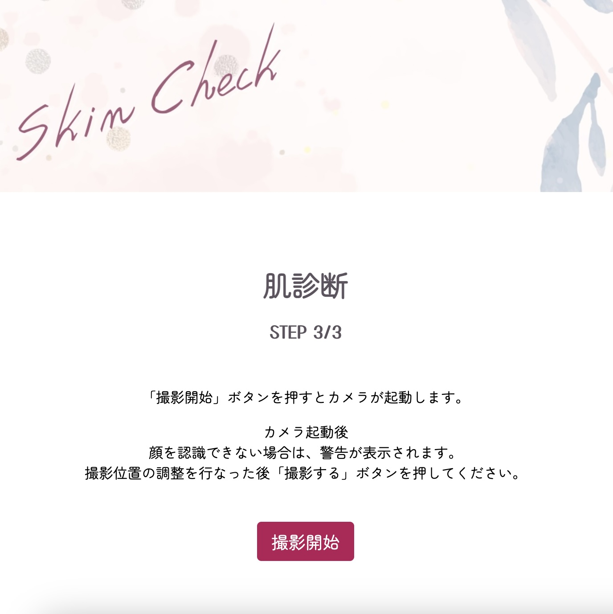
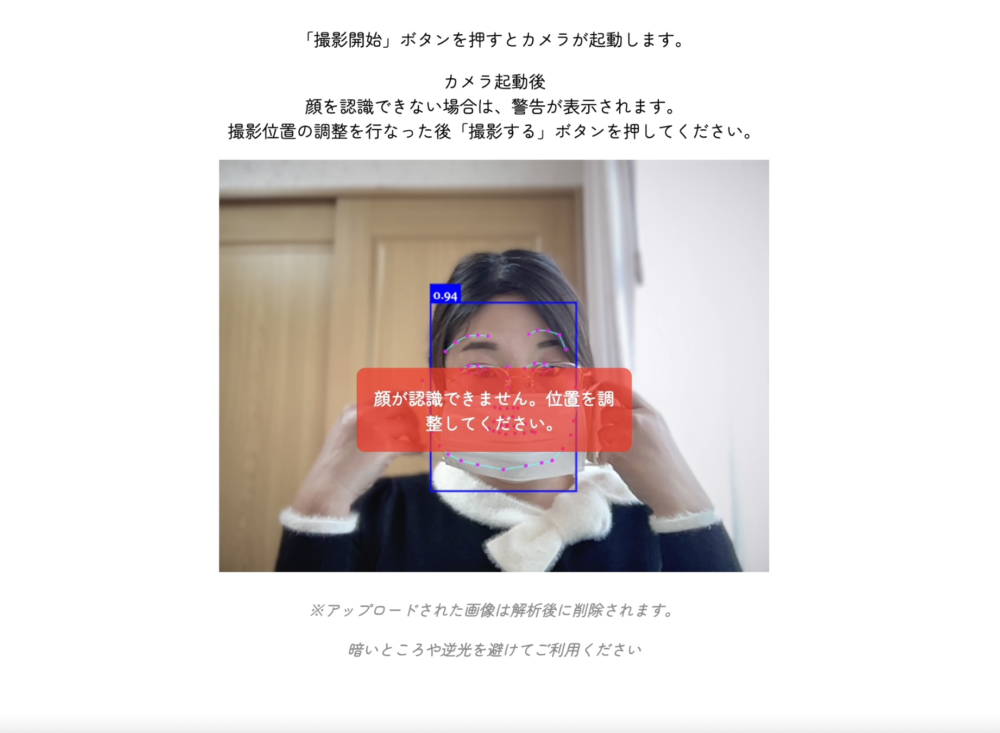
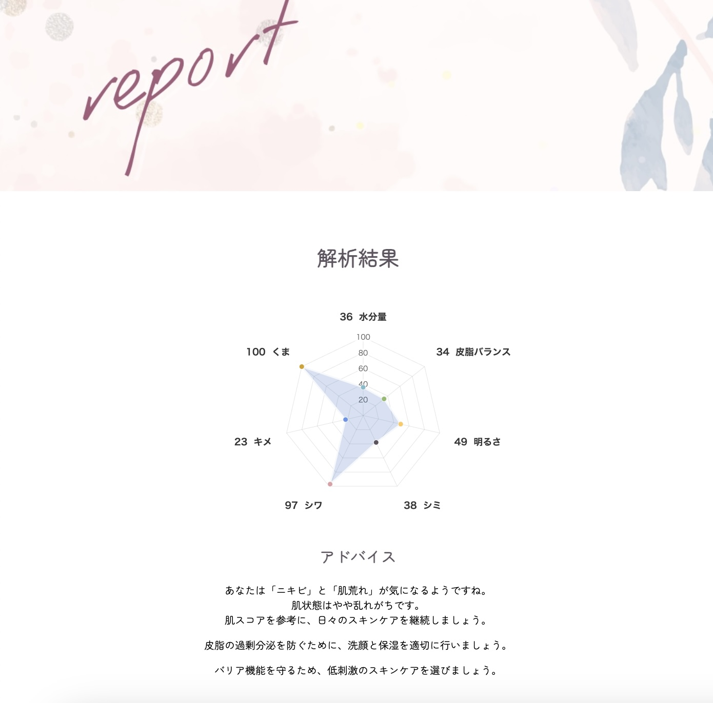
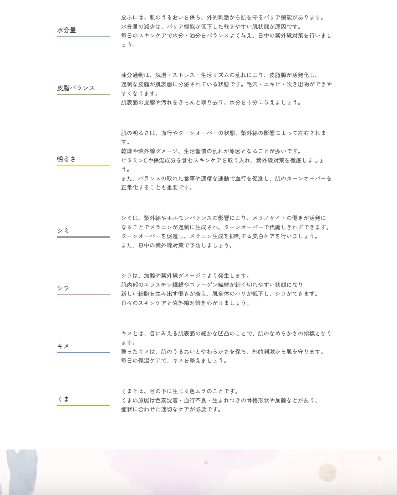
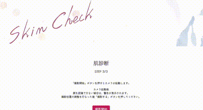
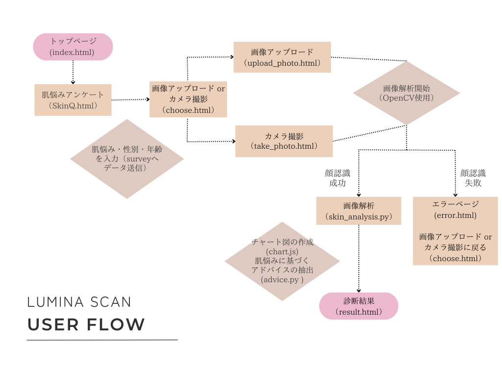

### 目次
- [💄アプリケーションのご説明](#app-description)
- [🎯ターゲットユーザー](#target-user)
- [💡アプリケーションの作成動機](#writing-motivation)
- [🏃‍♀️スタートガイド（環境構築 & 起動手順）](#getting-started)
- [🛠️アプリケーションの機能紹介](#app-features)
- [📈制作を通じて向上したスキル](#gained-skills)
- [💻使用技術](#tech-stack)
- [画面遷移図](#screen-flow)
- [ディレクトリー図](#directory-diagram)
<br>


## 💄アプリケーションについて<a id="app-description"></a>
LuminaScan は、画像処理技術を用いて肌の状態を数値化・可視化する肌診断アプリです。<br>
顔画像を解析し、水分量・皮脂バランス・明るさ・シミ・シワ・キメ・くま などの肌状態を数値化。 <br>
その結果に基づいて、適切なスキンケアアドバイスを提供します。<br>
<br>

【主な特徴】  
- 画像解析: 顔認識と画像処理技術を活用した肌コンディション診断
- スコア表示: 7つの肌指標を数値化し、グラフで可視化
- アドバイス提供: 診断結果に基づいたスキンケアの推奨
<br>


## 🎯ターゲットユーザー<a id="target-user"></a>
性別や年齢を問わず誰でも使える肌診断ツールです。  
清潔感を大切にしたいビジネスパーソンや、肌の変化が気になり始めた方にもおすすめです。  
スキンケアをもっと手軽に、スマートに取り入れたい方へ。  
<br>


## 💡作成したキッカケ<a id="writing-motivation"></a>
営業職として働く中で、商圏分析や客数予測などデータを活用した意思決定に触れる機会が多くありました。<br>
データをもとに未来を予測し、業務の最適化に貢献できる需要予測の面白さに魅了されるうちに<br>
「データを使うだけではなく、自分で分析の仕組みを作り出したい」という想いが芽生えました。<br>

しかし、需要予測の分野は個人で開発・検証を進めるにはハードルが高いと感じ、<br>
まずは、身近なテーマでデータ分析を実践できないかと考えました。<br>
そこで関心を持ったのが、「肌の状態を画像解析技術で数値化し、客観的に分析する」というアプローチです。<br>
このアイデアを形にするために、Lumina Scan の開発に取り組みました。<br>

<br>
画像解析やデータ分析の基礎を学びながら、実際に手を動かすことで理解を深めています。<br>
プログラマーとしての適性を試し、技術を習得することを目的とした個人プロジェクトです。<br>
<br>
<br>

---
---
## 🏃‍♀️スタートガイド（環境構築 & 起動手順）<a id="getting-started"></a>
以下の手順に従って ローカル環境 で実行できます。

#### 1. ZIPファイルをダウンロード
まずはアプリケーションのダウンロードと解凍してください。

#### 2. ディレクトリへ移動します。 
```
cd ~/Desktop/LuminaScan
```

#### 3. 仮想環境のセットアップ（venv）
```
python -m venv venv
source venv/bin/activate    # Windowsの場合は `venv\Scripts\activate`
```

#### 4. 必要なライブラリのインストール
```
pip install --upgrade pip  
pip install flask opencv-python-headless pillow numpy
```

#### 5. Flask アプリの起動  
```
python3 app.py
```

#### 6.成功すると…
Running on `http://127.0.0.1:5000/` と表示されます。<br> 
ブラウザを開いて以下のURLにアクセスしてください。
``` 
http://127.0.0.1:5000 
```
<br>

---
---

## 🛠️アプリケーション機能のご紹介<a id="app-features"></a>
#### ▶ 機能一覧

| トップページ | サービス内容 |
| ---------------- | ---------------- |
| [トップページ] |  |
| サービス紹介 | 3種類の診断メニュー |

| 肌に関するアンケート | 診断方法の選択 |
| ---------------- | ---------------- |
|  |  |
| 肌悩みの聞き取り機能を実装。 | **画像アップロード or カメラ撮影**<br>2種類の選択肢を実装。 |

| 写真撮影ページ | カメラ起動画面・顔認証 |
| ---------------- | ---------------- |
|  |  |
| カメラ起動前に注意事項を表示し、<br>撮影開始ボタンを押すとカメラが起動する<br>流れを実装。 | カメラ起動＋リアルタイムで顔認識システムを実装。<br>詳細な手順は、動画で解説。 |

| 結果ページ | 7項目の説明|
| ---------------- | ---------------- |
|  |  |
| 肌状態の採点・チャート図を表示<br>アドバイスの抽出表示を実装。 |                                   |


#### ▶ 機能サンプル動画
| サンプル動画                          | 説明                      |
|---------------------------------------|---------------------------|
|  | 肌診断→アンケート→写真撮影までの流れ |
|  | カメラ撮影時のリアルタイム顔認証 |
|  | 診断結果の表示と説明 |

<br>


## 📈 制作を通じて向上したスキル<a id="gained-skills"></a>
| スキル                         | 学習内容                           |
|------------------------------|------------------------------------|
|Webアプリ開発	                 |Flask × OpenCV を活用した、画像処理 & Webアプリの実装       |
|データ可視化	                    |Chart.js を用いた動的なデータの可視化|
|フロントエンド ↔ バックエンド連携   |JavaScript でのデータ取得・Chart.js への反映・Flaskとの連携　|
|GitHub運用による、バージョン管理　　|効率的なバージョン管理・README作成・リポジトリの整理力向上      |
<br>

「この方法で良いのか？」「このコードはどこと連動しているのか？」と考える習慣が身につきました。<br>
試行錯誤を重ねる中で、要件定義の重要性を改めて実感するとともに、設計段階での見通しを立てる力が<br>向上したと感じています。<br>


### 制作期間
#### 2025年1月中旬〜2月中旬までの約30日間（README記入含む）<br>


### 今後の目標
ローカル環境だけでなく、Heroku や AWS にデプロイし「誰でも気軽に使えるアプリ」 を目指します。<br>
データベースを導入し、解析結果を蓄積・活用できる仕組み を構築したいと考えています。<br>
<br>


## 💻使用技術<a id="tech-stack"></a>
| 分類         | 使用技術                     　　|
|--------------|-----------------------------|
| フロントエンド | HTML, CSS, JavaScript(Chart.js)    |
| バックエンド   | python(Flask・OpenCV)         　   |
| 開発ツール     | Visual Studio Code,GitHub, venv   |
<br>


### 画面遷移図<a id="screen-flow"></a>



### ディレクトリー図<a id="directory-diagram"></a>
```
LuminaScan/
├── app.py             # Flaskアプリケーション（メイン処理）
├── process.py         # OpenCVを用いたオーバーレイ処理
├── trimming.py        # トリミング・グレースケール処理
├── skin_analysis.py   # 肌の解析（重要）
├── advice.py          # アンケート結果処理

├── templates/         # HTMLテンプレート（フロントエンド）
│   ├── index.html         # トップページ
│   ├── skinQ.html         # 肌悩みアンケート
│   ├── choose.html        # 画像アップロード or 撮影の選択
│   ├── upload_photo.html  # 画像アップロード
│   ├── take_photo.html    # 撮影ページ
│   ├── animation.html     # アニメーション
│   ├── error.html         # エラーページ
│   └── result.html        # 結果ページ

├── static/           # 静的ファイル（モデル・スクリプト・画像など）
│   ├── models/           
│   │   └── weights/      # 学習済みモデルデータ（JSON形式）
│   │        ├── ssdMobilenetv1
│   │        ├── faceLandmark68Net
│   │        ├── faceRecognitionNet
│   │        └── その他のモデルファイル
│
│   ├── js/              # JavaScript（フロントエンドの動作）
│   │   ├── face-api.js       # 顔認証API
│   │   ├── face-api.min.js   # 顔認証API（ミニファイド版）
│   │   ├── skinQ.js          # アンケートページのスクリプト
│   │   ├── take-photo.js     # 撮影ページ（顔認識 99点以上で合格）
│   │   ├── upload-photo.js   # アップロードページ（顔認識 90点以上で合格）
│   │   ├── animation.js      # アニメーション処理
│   │   ├── chart.js          # 結果ページのグラフ
│   │   └── result.js         # 結果ページの処理
│
│   ├── css/            # スタイルシート（デザイン関連）
│   │   ├── animation.css     # アニメーション専用CSS
│   │   └── style.css         # 全体のスタイル
│
│   ├── 01uploads/      # 元画像（撮影・アップロードされた画像）
│   │   └── image1.jpg
│
│   ├── 02trimmed/      # トリミング後の画像（顔部分のみ）
│   │   └── image1.jpg

│   ├── 03gray/         # グレースケール後の画像
│   │   └── image1.jpg
│
│   ├── 03final/        # オーバーレイ済みの画像
│   │   └── image1.jpg
│
│   ├── fixed-images/   # 固定画像（ヘッダー・フッターなど）
│   │   ├── header.jpeg
│   │   └── footer.jpeg
```


