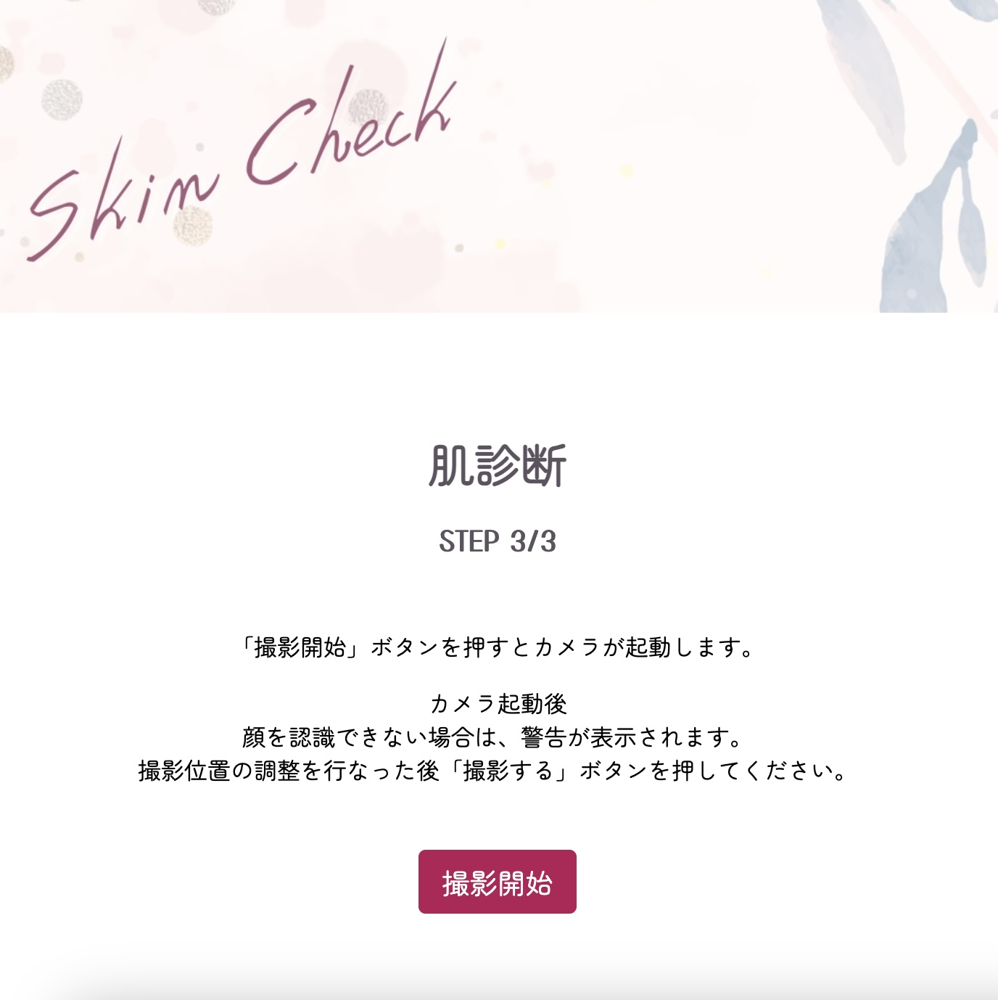

<div align="center">
  <picture>
    
  </picture>  
  <br>

  <center>
    <a href="README.md">
      
    </a>
    <a href="README_en.md">
      
    </a>
  </center>
</div>


# Lumina Scan - 


### Table of Contents
- [💄 Application Description](#app-description)
- [🎯 Target Users](#target-user)
- [💡 Motivation for Development](#writing-motivation)
- [🏃‍♀️ Getting Started](#getting-started)
- [🛠️ Application Features](#app-features)
- [📈 Skills Improved Through Development](#gained-skills)
- [💻 Technologies Used](#tech-stack)
- [📊 Screen Flow](#screen-flow)
- [📂 Directory Structure](#directory-diagram)
<br>


## 💄 About the Application<a id="app-description"></a>
LuminaScan is a skin analysis app that quantifies and visualizes skin conditions using image processing technology.<br>
It analyzes facial images to assess factors such as moisture, oil balance, brightness, spots, wrinkles, texture, and dark circles.<br>
Based on these results, it provides personalized skincare advice.<br>

Key Features
- Image Analysis: Skin condition diagnosis using facial recognition and image processing technology<br>

- Score Display: Quantifies seven skin indicators and visualizes them in graphs<br>

- Advice Provision: Provides skincare recommendations based on diagnosis results<br>
<br>


## 🎯 Target Users<a id="target-user"></a>
A skin analysis tool for everyone, regardless of gender or age.<br>
Perfect for business professionals who care about their appearance and anyone noticing changes in their skin.<br>
For those who want to make skincare easy, smart, and part of their daily routine.<br>
<br>


## 💡 Motivation for Development<a id="writing-motivation"></a>
While working in sales, I frequently made data-driven decisions, such as market analysis and customer demand forecasting.<br>
Through this experience, I became fascinated by demand prediction and developed a desire to not just use data, <br>but to build analytical systems myself.<br>
<br>
However, independently developing and testing demand forecasting models seemed too complex.<br>
So, I looked for a more accessible way to apply data analysis to a familiar topic.<br>
That’s when I came up with the idea of quantifying skin conditions using image analysis for objective evaluation, which led to the development of 『Lumina Scan』<br>
<br>
This personal project allows me to learn and apply image processing and data analysis hands-on strengthening my technical skills.<br>
It serves as both a learning experience and an opportunity to assess my potential as a programmer.<br>
<br>


---
---
## 🏃‍♀️ Getting Started<a id="getting-started"></a>
#### 1. Navigate to the directory
```
cd ~/Desktop/LuminaScan
```
#### 2. Set up a virtual environment (venv)
```
python -m venv venv
source venv/bin/activate    # If you're using Windows, run `venv\Scripts\activate`
```
#### 3. Install required libraries
```
pip install --upgrade pip  
pip install flask opencv-python-headless pillow numpy
```
#### 4. Start the Flask application
```
python3 app.py
```
#### 5. If successful...
You will see Running on `http://127.0.0.1:5000/`. Open your browser and go to:
```
http://127.0.0.1:5000/
```

---
---
<br>


## 🛠️ Application Features<a id="app-features"></a>
#### ▶ Feature List

| Top Page | Service Description |
| ---------------- | ---------------- |
| [トップページ] |  |
| Implemented a service description. | Implemented start buttons for three diagnostic modes. |

| Skincare Questionnaire | Select Diagnostic Method |
| ---------------- | ---------------- |
|  |  |
| Implemented a skin concern questionnaire feature.| **Image Upload or Camera Capture**<br>Implemented two options. |

| Take a Photo Page | Camera Launch・Face Recognition|
| ---------------- | ---------------- |
|  |  |
|Show a caution message<br>before launching the camera,<br>then activate it when the 'Start Shooting' button is pressed.|Implemented a real-time face recognition system. |

| Results Page | Explanation of 7 Items|
| ---------------- | ---------------- |
|  |  |
|Implemented skin scoring to evaluate skin condition. <br>Visualized results using a radar chart based on 7 indicators.| Implemented a feature to display appropriate skincare advice.|


#### ▶ Sample Feature Videos
| Sample Videos                         | Description               |
|---------------------------------------|---------------------------|
||ã€Face Recognition Flow】<br>Face recognition is performed using pre-trained models from face-api.js.<br><br>⚫︎ssdMobilenetv1 → Detects facial positions from the camera feed.<br>⚫︎faceLandmark68Net →  Identifies 68 facial landmarks (eyes, nose, mouth, contours).<br>⚫︎faceRecognitionNet → Calculates similarity scores; allows capturing if above a certain threshold.<br>|
||ã€Skin Scoring Flow】<br>Utilizing image analysis technology to quantify skin condition.<br><br>⚫︎Image Analysis → Analyzes brightness, saturation, and color balance to extract skin features.<br><br>⚫︎Feature Evaluation → Measures and quantifies factors like spots, wrinkles, dark circles, and moisture levels through image processing.<br>⚫︎Score Calculation → Integrates all evaluations and assigns a skin score out of 100.<br>|
<br>


## 📈 制作を通じて向上したスキル<a id="gained-skills"></a>
| Skill                        | Learning Content                   |
|------------------------------|------------------------------------|
|Web App Development            |Flask × OpenCV を活用した、画像処理 & Webアプリの実装       |
|Data Visualization             |Chart.js を用いた動的なデータの可視化|
|Front ↔ Back Integration       |JavaScript でのデータ取得・Chart.js への反映・Flaskとの連携　|
|Version Control with GitHub　  |効率的なバージョン管理・README作成・リポジトリの整理力向上      |
<br>

「この方法で良いのか？」「このコードはどこと連動しているのか？」と考える習慣が身につきました。<br>
試行錯誤を重ねる中で、要件定義の重要性を改めて実感するとともに、設計段階での見通しを立てる力が<br>向上したと感じています。<br>


### 制作期間
#### 2025年1月中旬〜2月中旬までの約30日間（README記入含む）<br>


### 今後の目標
ローカル環境だけでなく、Heroku や AWS にデプロイし「誰でも気軽に使えるアプリ」 を目指します。<br>
データベースを導入し、解析結果を蓄積・活用できる仕組み を構築したいと考えています。<br>
<br>


## 💻 Technologies Used<a id="tech-stack"></a>
| Category         | Technology Used              　|
|--------------|-----------------------------|
| Front-end    | HTML, CSS, JavaScript(Chart.js)    |
| Back-end     | python(Flask・OpenCV)         　   |
| Development Tools    | Visual Studio Code,GitHub, venv   |
<br>


### Screen Flow<a id="screen-flow"></a>


### ディレクトリー図<a id="directory-diagram"></a>
```
LuminaScan/
├── app.py             # Flaskアプリケーション（メイン処理）
├── process.py         # OpenCVを用いたオーバーレイ処理
├── trimming.py        # トリミング・グレースケール処理
├── skin_analysis.py   # 肌の解析（重要）
├── advice.py          # アンケート結果処理

├── templates/         # HTMLテンプレート（フロントエンド）
│   ├── index.html         # トップページ
│   ├── skinQ.html         # 肌悩みアンケート
│   ├── choose.html        # 画像アップロード or 撮影の選択
│   ├── upload_photo.html  # 画像アップロード
│   ├── take_photo.html    # 撮影ページ
│   ├── animation.html     # アニメーション
│   ├── error.html         # エラーページ
│   └── result.html        # 結果ページ

├── static/           # 静的ファイル（モデル・スクリプト・画像など）
│   ├── models/           
│   │   └── weights/      # 学習済みモデルデータ（JSON形式）
│   │        ├── ssdMobilenetv1
│   │        ├── faceLandmark68Net
│   │        ├── faceRecognitionNet
│   │        └── その他のモデルファイル
│
│   ├── js/              # JavaScript（フロントエンドの動作）
│   │   ├── face-api.js       # 顔認証API
│   │   ├── face-api.min.js   # 顔認証API（ミニファイド版）
│   │   ├── skinQ.js          # アンケートページのスクリプト
│   │   ├── take-photo.js     # 撮影ページ（顔認識 99点以上で合格）
│   │   ├── upload-photo.js   # アップロードページ（顔認識 90点以上で合格）
│   │   ├── animation.js      # アニメーション処理
│   │   ├── chart.js          # 結果ページのグラフ
│   │   └── result.js         # 結果ページの処理
│
│   ├── css/            # スタイルシート（デザイン関連）
│   │   ├── animation.css     # アニメーション専用CSS
│   │   └── style.css         # 全体のスタイル
│
│   ├── 01uploads/      # 元画像（撮影・アップロードされた画像）
│   │   └── image1.jpg
│
│   ├── 02trimmed/      # トリミング後の画像（顔部分のみ）
│   │   └── image1.jpg

│   ├── 03gray/         # グレースケール後の画像
│   │   └── image1.jpg
│
│   ├── 03final/        # オーバーレイ済みの画像
│   │   └── image1.jpg
│
│   ├── fixed-images/   # 固定画像（ヘッダー・フッターなど）
│   │   ├── header.jpeg
│   │   └── footer.jpeg
```

